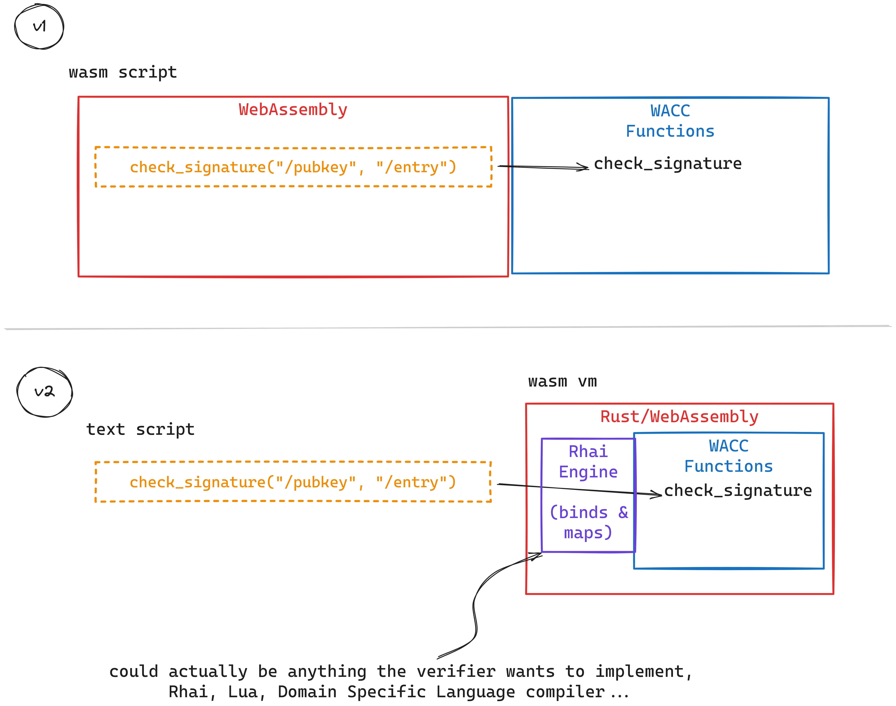

# Comrade

Comrade is a cross-platform, sandboxed, WebAssembly friendly, Browser compatible [VLAD (Verifiable Long-lived Addresses)](https://github.com/cryptidtech/provenance-specifications/blob/main/README.md#provenance-specifications) virtual machine. It's a simple, text based, iteration on the [original WACC](https://github.com/cryptidtech/provenance-specifications/blob/main/specifications/wacc.md) concept. Comrade is another friend of VLAD.

## Comparison to WACC v1



## Usage

Natively, in Rust:

```rust
use std::error::Error;
use comrade_core::{ComradeBuilder};
use comrade_core::context::ContextPairs;
use comrade_core::storage::pairs::Pairs;
use comrade_core::storage::stack::Stack;
use comrade_core::storage::stack::Stk;
use comrade_core::storage::value::Value; 
use comrade_core::context::{Proposed, Current};

fn main() -> Result<(), Box<dyn Error>> {

    let entry_key = "/entry/";

    // unlock
    let entry_data = b"for great justice, move every zig!";
    let proof_key = "/entry/proof";
    let proof_data = hex::decode("b92483a6c00600010040eda2eceac1ef60c4d54efc7b50d86b198ba12358749e5069dbe0a5ca6c3e7e78912a21c67a18a4a594f904e7df16f798d929d7a8cee57baca89b4ed0dfd1c801").unwrap();

    let mut kvp_unlock = ContextPairs::default();
    kvp_unlock.put(entry_key, &entry_data.to_vec().into());
    kvp_unlock.put(proof_key, &proof_data.into());

    // unlock script logic, in Rhai
    let unlock = r#"
        // push the serialized Entry as the message
        push("/entry/"); 

        // push the proof data
        push("/entry/proof");
    "#;

    // lock script logic, in Rhai
    let first_lock = r#"
        // check the first key, which is ephemeral
        check_signature("/ephemeral", "/entry/")
    "#;

    let other_lock = r#"
        // then check a possible threshold sig...
        check_signature("/recoverykey", "/entry/") ||

        // then check a possible pubkey sig...
        check_signature("/pubkey", "/entry/") ||

        // then the pre-image proof...
        check_preimage("/hash")
    "#;

    let locks = [first_lock, other_lock];

    let pubkey = "/pubkey";
    let pub_key = hex::decode("ba24ed010874657374206b657901012069c9e8cd599542b5ff7e4cdc4265847feb9785330557edd6a9edae741ed4c3b2").unwrap();
    let mut kvp_lock = ContextPairs::default();
    kvp_lock.put(pubkey, &pub_key.into());

    let unlocked = ComradeBuilder::new(&unlock, Current(kvp_lock), Proposed(kvp_unlock))
        .with_domain("/")
        .try_unlock()?;

    let mut count = 0;

    for lock in locks {
        if let Some(Value::Success(ct)) = unlocked.try_lock(lock.to_string())? {
            count = ct;
            break;
        }
    }

    assert_eq!(count, 1);


Ok(())
}
```

In the Browser, you would pull Comrade in as a dependecy to `provenance_log` crate, compile to wasm, and then use it. 

## Rationale

The main rationale behind Comrade to to iterate on the Script Format to gain simplicity and flexibility, while keeping security guarantees high.

The initial design for the WebAssembly Cryptographic Constructs Virtual Machine has two heavy dependecies:
1. Wasmtime
2. Wasm Scripts

These dependecies place certain limitations on the user, namely:
- The user must write or compile to WebAssembly Text Format (WAT)
- Scripts cannot be written in the browser, nor can key-paths and values be dynamic
- It only will currently run wherever wasmtime runs, which excludes the browser

The goal here is to maintain the similar security guarantees as the WebAssembly Cryptographic Constructs Virtual Machine, but to remove the limitations imposed by using wasm _scripts_ instead of wasm _logic_. We can do this by shifting the logic to Rhai Script, while maintaining the ability to run that logic in wasm.

Rhai is to Rust/WebAssembly as Miniscript is to Bitcoin Script. It's a higher level language that is more expressive and easier to use, yet offers the same end-goal of sandboxing for running untrusted code.

With Comrade, the only functions available are the same that are available in WACC VM (`push`, `check_signature`, etc.). If any other function is called, the code will `Error`.

As a simple example of the huge benefit gain here, imagine constructing the scripts and the operations in the browser, all checked in advance, then executing this text in Comrade. Magic! Another huge benefit example would be compiling this to Wasm or together with a provenance log library, then compiling that to WebAssembly and running `log.verify()` as a wasm function, on any platform.

## But, isn't raw Wasm safer than Rhai?

Let's keep in mind that all Rhai does is bind the lock and unlock _logic_ to the Cryptographic Constructs _functions_. It's a mapped binding, just like WACC. In reality, we could use _any_ binding. We could choose Lua script, or write a Domain specific language (DSL) but Rhai is already written in Rust, for Rust, so it's a good choice at this time.

Rhai has very few dependecies but sure, "there's always a risk." But even [Wasmtime has security flaws](https://www.opencve.io/cve?vendor=bytecodealliance&product=wasmtime) so nothing is perfect. I'm no security engineer but I understand that "Security" is progressive concept based on a threat risk asessment. Can someone hack into Rhai codebase and make a malicious script look valid? Theoretically I suppose, but the same could be said about any software supply chain.   

There are always tradeoffs. The most secure options are rarely used because they're impractical or costly. If something doesn't get used, it doesn't get adopted and it doesn't matter which security hairs you are splitting. Even HTTP only got the "S" after 1994, and even then not everyone was using because the internet was just a fad.

Raw wasm is tedious to write, edit, and maintain making it prone to error and writing new scripts that compile to Wasm take a certain level of knowledge and expertise that is beyond even many developers. I think that if a new JavaScript developer can't easily integrate it into their code, they probably won't. 

I assessed any additional risk as low, and there's more likely to be a vulnerability in your code somewhere then to have one injected through Rhai. Testing is whole lot easier to write and fuzz with strings.

Also, the Rhai script is _exactly the same_ as the Rust code, eliminating any conversion steps, errors, and bugs.

### But I reallllllllly want to use Wasm for my scripts

That's ok! This iteration is interoperable!

#### Rhai to WACC

You would just take the lock script and use [include_str!](https://doc.rust-lang.org/std/macro.include_str.html) in your Rust code to build the source, then compile that to *.wasm/*.wat, then use that as your value when generating the VLAD CID instead of the String. In fact, you could probably make a script or a CLI that does it for you.

Scripts in Plogs can be either Code Strings (like Rhai script) or Binary (like wasm), so the current specification should support this.

#### WACC to Rhai

The reverse is also possible by converting the WACC scripts to Rhai scripts. The logic and code are **exactly** the same in Rust and Rhai. This could be done with a simple script or CLI as well.

### Comparison table of WACC to Rhai 

| Feature | WACC | Rhai |
| --- | --- | --- | 
| WebAssembly | :white_check_mark: | :white_check_mark: |
| Sandboxed | :white_check_mark: | :white_check_mark: |
| Limited API Surface | :white_check_mark: | :white_check_mark: |
| Runs in Browser | :x: | :white_check_mark: |
| Runs in Embedded | :x: | :white_check_mark: |
| Scripts | Compiled Wasm | Text |
| Complexity | High | Low |
| Integrates with React | :x: | :white_check_mark: |

# Test

To build all crates that are WIT Components, run:

```sh
cargo test --workspace
```

# Status: It works.

This code and the scripts are pretty simple and it Just Works(TM).
